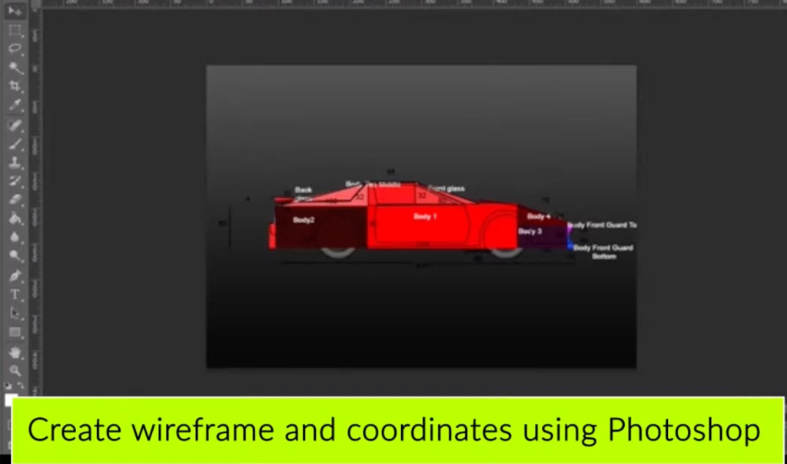
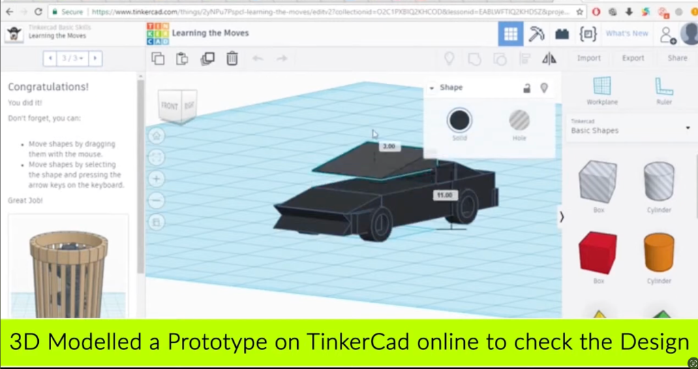

# Knight Rider OpenGL: Interactive 3D City & Vehicle Simulation
---

## 🏎️ Project Overview
This project presents a fully interactive 3D simulation of the iconic **Knight Rider (KITT)** vehicle navigating a procedurally and hierarchically modeled city environment. Developed entirely from scratch using **C++** and the **OpenGL Utility Toolkit (GLUT)**, the project serves as a comprehensive exploration of low-level 3D computer graphics, real-time rendering, and mathematical kinematics.

[**🎬 Watch the Gameplay & Development Demo on YouTube**](https://www.youtube.com/watch?v=OpR7b9zOqoE)

---

## 🛠️ Development & Prototyping

Before writing any C++ OpenGL code, the vehicle and environment were meticulously prototyped:

1. **3D Modeling & Verification (Tinkercad)**: A preliminary model was built in Tinkercad to conceptualize the proportions of the iconic vehicle.
   

2. **Wireframe & Coordinate Mapping (Photoshop)**: The 3D model was then projected into 2D orthogonal views in Photoshop. Exact relative coordinates were mapped out to serve as the vertex data for the OpenGL primitives.
   

---

## 📖 The Full Story: Building a Virtual World from Scratch

Creating a 3D environment without a modern game engine requires constructing every vertex, normal, and texture coordinate manually. This project was divided into several phases:

1.  **Hierarchical Vehicle Modeling**: Designing KITT involved breaking down the complex geometry into hierarchical primitives (cuboids, cylinders, polygons). The wheels, chassis, and glass were modeled relatively, allowing independent transformations (like steering).
2.  **Environmental Architecture**: Building a dynamic city with a road network, curved pond surfaces, and procedurally generated fractal forests.
3.  **The Physics Engine**: Implementing rudimentary physics for "Turbo Boosts" and spatial awareness for collision detection between the vehicle and environmental hazards (e.g., fallen trees).

---

## 🧮 Mathematical Foundations & Physics

### 1. Collision Detection (Euclidean Distance)
To prevent KITT from clipping through environmental objects (like trees), a bounding-sphere collision detection system is implemented. The algorithm continuously calculates the 3D Euclidean distance between the center of the car and the obstacle:

$$ \Delta = \sqrt{(X_{car} - X_{obj})^2 + (Y_{car} - Y_{obj})^2 + (Z_{car} - Z_{obj})^2} $$

If the distance $\Delta$ is less than the sum of their protective radii (`KITTSafeReg` + `TreeSafeReg`), a collision is registered.

### 2. Kinematics: Simple Harmonic Motion
The project utilizes sinusoidal functions to create smooth, natural animations rather than linear translations.

*   **KITT's Scanner**: The iconic red scanner light sweeps back and forth using Simple Harmonic Motion (SHM) governed by the system clock:
    $$ Y_{scanner} = A \cdot \sin(\omega \cdot t) $$
    *(Implementation: `scannerY_dark = 0.15 * sin(1 * relative_clock);`)*
*   **Pond Water Waves**: The curvature and rippling of the pond surface are also driven by sinusoidal time-stepping.
*   **Turbo Boost**: The jump height during a turbo boost follows a parabolic sine arc to simulate gravitational pull and momentum:
    $$ Height_{turbo} = 2 \cdot \sin(\theta) $$

### 3. Camera Transformations (View Matrix)
The user can seamlessly switch between multiple dynamic camera perspectives (Side View, Back View, Tire View, Map View). This is achieved by recalculating the **View Matrix** via `gluLookAt`, which requires the camera position $(e_x, e_y, e_z)$, the target point $(c_x, c_y, c_z)$, and the UP vector $(u_x, u_y, u_z)$.

---

## 🖥️ Advanced Computer Graphics Techniques

### 🌲 Fractal Generation (Recursive Trees)
The environment features a dense forest generated using **L-System inspired recursive fractals**.
A `DrawFractalBranch(len)` function recursively calls itself, splitting into two new branches rotated by $+30^\circ$ and $-30^\circ$, scaling the length by $0.66$ until a base condition is met. This creates highly organic, complex tree structures with minimal code footprint.

### 💡 Lighting and Material Shading (Phong Model)
The simulation employs the **Phong Reflection Model** to calculate how light interacts with surfaces, creating depth and realism:
1.  **Ambient Light**: General environmental illumination.
2.  **Diffuse Light**: Directional light scattering (sunlight/streetlights).
3.  **Specular Light**: The bright, shiny highlights on KITT's metallic chassis.
*Dynamic Spotlights* (`GL_SPOT_DIRECTION`, `GL_SPOT_CUTOFF`) are attached to the front of the car to simulate high-beam headlights illuminating the road dynamically.

### 🖼️ Texture Mapping
Custom Bitmap (`.bmp`) parsing is implemented from scratch (without external image loaders) to read 24-bit RGB pixel data and map it onto OpenGL Quads using UV Coordinates, giving the roads (`road1.bmp`) and grass (`grass5.bmp`) realistic textures.

---

## 🛠️ Installation & Execution

### Prerequisites
*   Windows OS (Executable provided)
*   **Code::Blocks** IDE (if compiling from source)
*   MinGW Compiler with OpenGL/GLUT libraries linked.

### Running the Game
1.  **Direct Execution**: Navigate to the repository root and run `KnightRider Race.exe`.
2.  **Compilation**: Open `KnightRider Race.cbp` in Code::Blocks, ensure GLUT is linked in your compiler settings, and build the project.

### Controls
*   **Arrow Keys**: Drive the vehicle (Accelerate, Brake, Steer).
*   **Camera Views**: Toggle through different cinematic perspectives to experience the rendering pipeline.

---
*Developed as an Academic Exploration into Core Computer Graphics.*
